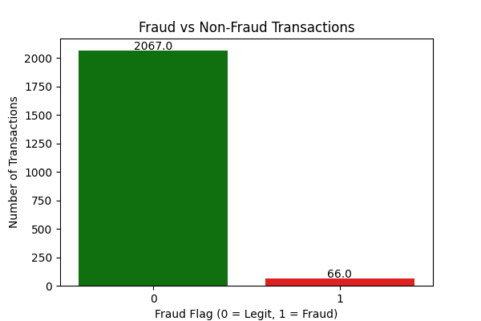

# Luxury Retail Fraud Detection Project (2025)

A **Python + SQL hybrid case study** analyzing real-time luxury retail transactions to detect fraud patterns, understand customer behavior, and identify high-risk transactions.  

This project demonstrates **data cleaning, analysis, visualization, and SQL reporting**, making it ideal for showcasing data analytics and data engineering skills.

---


---

## 🛠 Tools & Libraries Used

- **Python Libraries:** `pandas`, `numpy`, `matplotlib`, `seaborn`  
- **SQL:** MySQL for querying and aggregating data  
- **Visualization:** Bar charts, scatter plots, histograms, pie charts  
- **IDE:** VS Code  

---

## 📊 Key Insights from Analysis

1. **Fraud vs Legit Transactions:**  
   - Total Fraudulent Transactions: **66**  
   - Total Legit Transactions: **2067**  

2. **Fraud by Customer Loyalty Tier:**  
   - Highest fraud in **Bronze**, followed by **Silver** and **Gold**.  

3. **Customer Age vs Purchase Amount:**  
   - Fraud mostly occurs in **younger to middle-age customers**.  
   - Older customers have fewer fraud cases.  

4. **Fraud by Payment Method:**  
   - **Debit cards** are most targeted, followed by **gift cards** and **mobile payments**.  

5. **Purchase Amount Distribution:**  
   - Fraudulent transactions are more frequent at **lower to mid-range purchase amounts**.  

6. **High-Risk Transactions:**  
   - Flagged using **high purchase amounts and Bronze loyalty tier** criteria.  

---

## 📈 Sample Visualizations

  
*Fraudulent vs Legitimate transactions*


*Fraud distribution across customer loyalty tiers*

  
*Scatter plot showing age vs purchase amount for fraud and legit transactions*

  
*Pie chart showing fraud distribution across payment methods*

  
*Histogram of purchase amounts for fraud and legitimate transactions*


---

## 📋 Insights Summary Table

| Category | Key Insight | Notes / Interpretation |
|----------|------------|-----------------------|
| **Fraud vs Legit Transactions** | Fraudulent: 66 / Legit: 2067 | Dataset highly imbalanced (~3% fraud cases) |
| **Fraud by Loyalty Tier** | Bronze > Silver > Gold | Lower-tier customers more prone to fraud |
| **Customer Age vs Purchase Amount** | Fraud mostly 25–60 age group | Middle-aged customers are more targeted; older (60+) and younger (<25) less affected |
| **Fraud by Payment Method (SQL)** |Highest fraud risk in Mobile/Debit/Gift Cards; focus on verification for these methods |
| **Average Spend by Loyalty Tier (SQL)** | Bronze: 175.16, Silver: 174.96, Gold: 173.11, VIP: 174.47, Platinum: 170.79, Other: 181.43 | Spend is consistent across tiers; fraud is not solely spend-driven |
| **Age Group Fraud Patterns (SQL)** | 41–60: 32, 25–40: 18, Under 25: 9, 60+: 7 | Fraud concentrated in middle-aged customers (41–60) |
| **Top 3 Stores by Fraud % (SQL)** | CONCESSION-SINGAPORE: 4.66%, POPUP-MILAN: 4.52%, FLAGSHIP-PARIS: 4.27% | These stores have the highest fraud %; monitoring and stricter checks recommended |
| **High-Risk Transactions (Python)** | Transactions >5000 & Bronze tier flagged | Helps prioritize transactions for manual review |
| **Purchase Amount Distribution (Python)** | Fraud clusters around mid-to-high amounts | Focus on medium/high-value transactions for verification |
| **Visual Insights (Python)** | See saved plots in `Images/` folder | Supports dashboards and presentations |

---

## 💡 SQL Insights

- Monthly high-risk transaction trends  
- Fraud percentage by store  
- Average spend by customer loyalty tier  
- Fraud vs high-risk transaction overlap  
- Average footfall analysis  

*(All SQL queries available in `SQL_Queries/fraud_queries.sql`)*


## 🚀 How to Run the Project

1. **Clone the repository:**

```bash
git clone https://github.com/kanchanchauha/luxury-retail-fraud-detection.git
